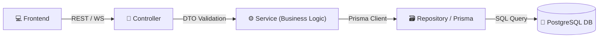
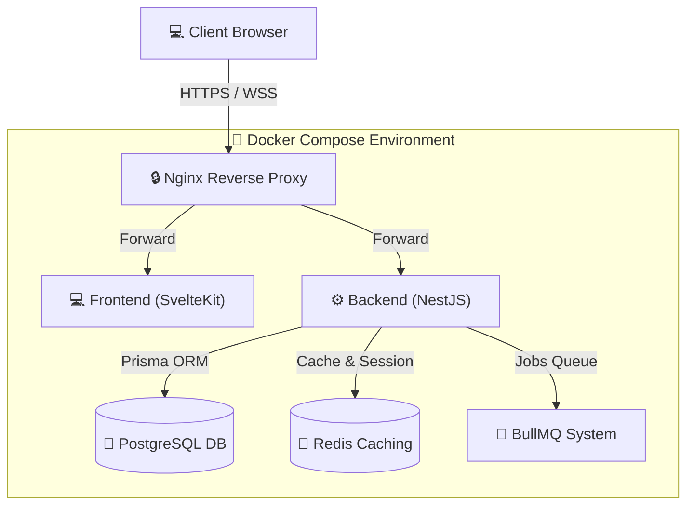

# Arsitektur Sistem

Dokumen ini menjelaskan stack teknologi, struktur monorepo, arsitektur frontend/backend, skema database, mekanisme keamanan, antrean, caching, serta strategi deployment sistem Kasir Apotik.

---

## 1. Stack Utama

### Frontend

| Teknologi          | Peran / Keterangan                                                     |
| :----------------- | :--------------------------------------------------------------------- |
| **SvelteKit**      | Framework utama untuk UI, routing, dan Server-Side Rendering (SSR).    |
| **TypeScript**     | Penjamin type safety di seluruh lapisan frontend.                      |
| **TailwindCSS**    | Utility-first CSS framework untuk styling yang cepat dan responsif.    |
| **TanStack Query** | Manajemen state asinkronus (data fetching, caching, dan sinkronisasi). |
| **TanStack Table** | Engine tabel untuk mengelola data tabular yang kompleks.               |
| **shadcn/ui**      | Koleksi komponen UI modular yang dapat disesuaikan.                    |

### Backend

| Teknologi              | Peran / Keterangan                                                           |
| :--------------------- | :--------------------------------------------------------------------------- |
| **NestJS**             | Framework Node.js dengan arsitektur modular terstruktur berbasis TypeScript. |
| **Prisma ORM**         | Object-Relational Mapping (ORM) yang type-safe untuk interaksi database.     |
| **JWT Authentication** | Standar keamanan untuk autentikasi stateless berbasis token.                 |
| **WebSocket**          | Komunikasi dua arah (real-time) untuk update transaksi dan stok.             |

### Database & Caching

| Teknologi      | Peran / Keterangan                                                                      |
| :------------- | :-------------------------------------------------------------------------------------- |
| **PostgreSQL** | Database relasional utama untuk menyimpan data transaksi, produk, dan pengguna.         |
| **Redis**      | Penyimpanan in-memory untuk caching data cepat dan manajemen session / state WebSocket. |

### Infrastruktur & DevOps

| Teknologi  | Peran / Keterangan                                                                  |
| :--------- | :---------------------------------------------------------------------------------- |
| **Docker** | Containerisasi aplikasi untuk mempermudah deployment dan standardisasi environment. |
| **Nginx**  | Reverse proxy, SSL termination, dan static file serving.                            |

---

## 2. Struktur Monorepo

Proyek ini dikembangkan dengan struktur monorepo untuk mengorganisir aplikasi client, server, serta konfigurasi global.

```
kasir-apotik/
├── apps/
│   ├── web/          # Frontend (SvelteKit)
│   └── api/          # Backend (NestJS)
└── packages/
    ├── ui/           # Shared UI Components (shadcn/Tailwind)
    ├── types/        # Shared TypeScript Types & Interfaces
    └── config/       # Shared Configurations (ESLint, Prettier, tsconfig)
```

---

## 3. Struktur Direktori Utama

### A. Frontend Architecture (`apps/web`)

```
apps/web/src/
├── lib/              # Helper, utils, dan fungsi penunjang global
├── routes/           # Router halaman berbasis SvelteKit routing
├── components/       # Komponen UI spesifik halaman atau reusable
├── stores/           # State management client (Svelte Store)
├── services/         # Integrasi API client dan HTTP requests
├── types/            # Definisi tipe TypeScript lokal
└── hooks/            # Router interceptor (auth, cookies, session)
```

### B. Backend Architecture (`apps/api`)

```
apps/api/src/
├── modules/          # Modul bisnis terisolasi (domain modules)
│   ├── auth/         # Autentikasi JWT & Refresh Token
│   ├── users/        # Manajemen user & role
│   ├── products/     # Katalog obat/produk
│   ├── inventory/    # Logistik, stok, & mutasi obat
│   ├── sales/        # Transaksi kasir (penjualan)
│   ├── purchases/    # Pembelian stok baru dari supplier
│   ├── suppliers/    # Data pemasok obat
│   └── reports/      # Laporan keuangan, penjualan, & stok
├── common/           # Interceptors, filters, guards, & decorators global
├── config/           # Konfigurasi aplikasi & environmental validation
└── prisma/           # Konfigurasi ORM, skema model, & migrasi
```

---

## 4. Pola Arsitektur & Request Flow

Backend menggunakan pola **Modular Architecture** dan **Clean Architecture** dengan menerapkan **Service-Repository Pattern**:

- **Controller**: Menerima request HTTP/WebSocket, memvalidasi DTO, dan mengirim response.
- **Service**: Mengelola logika bisnis utama sistem.
- **Repository (Prisma ORM)**: Penghubung langsung ke database relasional.

### Request Flow



---

## 5. Autentikasi & Otorisasi

Sistem mengamankan akses data menggunakan token JWT dengan skema sebagai berikut:

- **Token Management:**
  - **Access Token:** JWT berdurasi pendek untuk autentikasi request API.
  - **Refresh Token:** Disimpan aman di cookie client untuk regenerasi token baru tanpa re-login.
- **Role-Based Access Control (RBAC):**
  Hak akses dibatasi secara ketat berdasarkan tingkatan peran (_role_):

| Peran (Role)    | Hak Akses Utama                                                            |
| :-------------- | :------------------------------------------------------------------------- |
| **Super Admin** | Kontrol penuh sistem, pengaturan konfigurasi, dan monitoring log global.   |
| **Admin**       | Pengelolaan master data produk, manajemen supplier, dan penarikan laporan. |
| **Kasir**       | Akses cepat transaksi penjualan (kasir), kelola pelanggan, dan pembayaran. |
| **Gudang**      | Pengelolaan stok masuk (pembelian), opname fisik, dan retur supplier.      |

---

## 6. Arsitektur Database & Inventori

### Tabel Utama (Main Tables)

Database PostgreSQL membagi data ke dalam domain table:

- **Autentikasi:** `users`, `roles`
- **Katalog & Stok:** `products`, `categories`, `inventories`, `stock_movements`
- **Transaksi:** `sales`, `sale_items`, `purchases`, `purchase_items`, `customers`, `payments`
- **Mitra:** `suppliers`

### Logistik & Perubahan Stok (Inventory Architecture)

Setiap mutasi fisik obat **wajib** dicatat ke dalam history log `stock_movements` guna menjamin audit trail yang akurat.

Tipe pergerakan stok (_movement types_):

- `IN`: Stok masuk hasil dari transaksi pembelian ke supplier.
- `OUT`: Stok berkurang akibat penjualan di kasir.
- `ADJUSTMENT`: Koreksi jumlah stok dari hasil stock opname berkala.
- `EXPIRED`: Pembuangan/penghapusan stok obat yang kedaluwarsa.
- `RETURN`: Penerimaan stok kembali dari retur pelanggan/supplier.

---

## 7. Realtime, Cache, & Background Job



### Realtime Architecture (WebSockets)

WebSocket digunakan untuk menjaga konsistensi state data secara instan tanpa perlu membebani REST API dengan long-polling:

- Sinkronisasi real-time stok obat di dashboard kasir saat transaksi terjadi.
- Sinkronisasi multi-kasir jika menggunakan beberapa terminal kasir sekaligus.
- Push notifikasi mendadak (misalnya, stok kritis atau obat mendekati expired).

### Cache Architecture (Redis)

Redis berfungsi sebagai in-memory database cepat untuk:

- Caching data yang jarang berubah (data master produk, opsi supplier, dll).
- Session storage & WebSocket connection state.
- Broker pesan pub/sub untuk sinkronisasi WebSocket cluster.

### Background Queue (BullMQ)

Menggunakan Redis sebagai backend untuk memproses pekerjaan berat secara asinkron tanpa menahan _main thread_ API:

- **Export Laporan:** Pembuatan file laporan PDF/Excel penjualan berukuran besar.
- **Scheduled Tasks:** Pengecekan otomatis harian status obat kedaluwarsa.
- **Backup Database:** Penjadwalan pencadangan otomatis DB PostgreSQL ke storage eksternal.
- **Notification:** Antrean pengiriman email atau integrasi chat notifikasi.

---

## 8. Keamanan & Monitoring (Security & Operations)

### Security Layer

- **Helmet:** Mengamankan HTTP headers untuk meminimalkan eksploitasi web umum (XSS, Clickjacking).
- **Rate Limiter:** Mencegah spamming request dan serangan DDoS ringan pada API.
- **Validation Pipe & DTO:** Memastikan tipe payload request valid sebelum diproses oleh layer service.
- **Password Hashing:** Enkripsi password menggunakan modul hashing `bcrypt`.
- **Audit Log:** Pencatatan otomatis log aktivitas penting untuk kebutuhan penelusuran pelanggaran/kesalahan data.

### Logging System

- **Pino Logger:** Library logging berkecepatan tinggi yang terintegrasi di NestJS.
- **Request Logging:** Logger terperinci untuk melacak rute akses masuk, waktu respons, dan kode status.
- **Error & Audit Logging:** Pencatatan komprehensif kesalahan runtime dan audit log modifikasi data.

### Monitoring

- **Sentry:** Tracking error langsung di server produksi baik dari frontend maupun backend.
- **Docker Healthcheck:** Verifikasi otomatis status kontainer berjalan agar sistem dapat mendeteksi kegagalan layanan lebih cepat.
- **PM2 Monitoring:** Melacak penggunaan memori dan performa proses Node.js.

---
